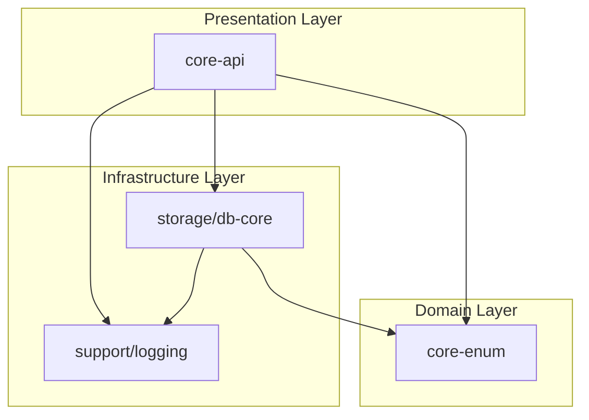

# Project Architecture & Code Flow

## 🏗 Module Architecture

이 프로젝트는 **Multi-Module Layered Architecture**를 따릅니다.
각 모듈은 명확한 책임과 역할을 가지며, 단방향 의존성을 유지합니다.

### Module Dependency Diagram

## 🚀 모듈 상세 설명 (Module Details)

### 1. Core Layer
비즈니스 로직과 API 진입점을 담당하는 핵심 레이어입니다.

*   **`core-api`**
    *   **역할:** 실제 실행되는 애플리케이션 모듈입니다. Controller, Service, Domain 로직이 포함됩니다.
    *   **주요 기능:** 상품(Product) API, 공통 응답/에러 처리
    *   **의존성:** `core-enum`, `db-core`, `logging`, `monitoring`

*   **`core-enum`**
    *   **역할:** 프로젝트 전반에서 공유되는 Enum 클래스를 관리합니다.
    *   **이유:** API, DB 등 여러 모듈에서 공통으로 사용되는 상수 값을 한 곳에서 관리하여 순환 참조를 방지합니다.

### 2. Storage Layer
데이터 저장소와 관련된 로직을 담당합니다.

*   **`db-core`**
    *   **역할:** JPA Entity, Repository 등 DB 접근 계층을 캡슐화합니다.
    *   **특징:** `core-api`는 이 모듈을 통해 DB에 접근하며, 직접적인 DB 의존성을 분리합니다.

### 3. Support Layer
비즈니스 로직 외의 공통 인프라 및 지원 기능을 담당합니다.

*   **`logging`**
    *   **역할:** Logback 설정 및 로깅 관련 공통 설정을 제공합니다.
    *   **특징:** 각 모듈에서 일관된 로깅 정책을 사용할 수 있도록 지원합니다.

