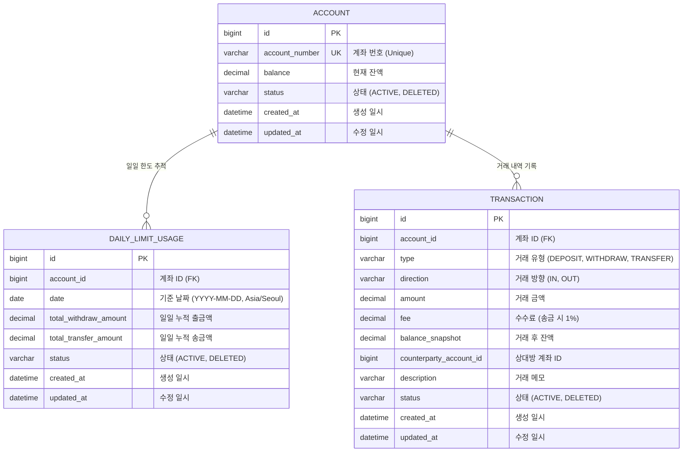

# 뱅킹 시스템 ERD (Banking System ERD)

## 개요 (Overview)
이 ERD는 계좌, 잔액/거래 내역, 한도 관리, 송금 기능 요구사항을 기반으로 설계되었습니다.

### 주요 기능 (Key Features)
- **계좌 (Account)**: `status` 필드를 통해 Soft Delete를 지원합니다.
- **일일 한도 (Daily Limit)**: `DAILY_LIMIT_USAGE` 테이블을 사용하여 일일 출금 및 송금 금액을 별도로 추적합니다.
- **거래 내역 (Transaction)**: 모든 자금 흐름(입금, 출금, 송금)을 기록하며, 송금의 경우 `OUT`/`IN` 방향을 지원합니다.

## 테이블 상세 (Table Details)

### 1. ACCOUNT (계좌)
- 계좌 정보를 저장합니다.
- `account_number`: 고유한 계좌 번호입니다.
- `status`: Soft Delete(삭제 처리)를 위해 사용됩니다 (`ACTIVE`, `DELETED`).
- `balance`: 현재 계좌의 잔액입니다.
- `created_at`, `updated_at`: 생성 및 수정 시간을 자동으로 기록합니다.

### 2. DAILY_LIMIT_USAGE (일일 한도 사용량)
- 출금 및 송금 한도 제한을 위해 일일 사용량을 추적합니다.
- `date`: Asia/Seoul 시간대 기준 00:00~23:59를 하루로 간주합니다.
- `total_withdraw_amount`: 해당 날짜의 총 출금액입니다.
- `total_transfer_amount`: 해당 날짜의 총 송금액입니다.
- `account_id`와 `date`의 조합은 유니크해야 합니다.

### 3. TRANSACTION (거래 내역)
- 모든 금융 활동(입금, 출금, 송금) 로그를 기록합니다.
- `type`: 거래의 종류를 나타냅니다 (`DEPOSIT`, `WITHDRAW`, `TRANSFER`).
- `direction`: 자금의 흐름을 나타냅니다.
    - `IN`: 입금, 송금 받기 (잔액 증가)
    - `OUT`: 출금, 송금 보내기 (잔액 감소)
- `fee`: 거래 수수료를 별도로 기록합니다 (예: 송금 보내기 시 발생).
- `balance_snapshot`: 거래가 완료된 직후의 계좌 잔액을 저장합니다.
- `counterparty_account_id`: 이체 시 상대방의 계좌 ID를 저장합니다.
