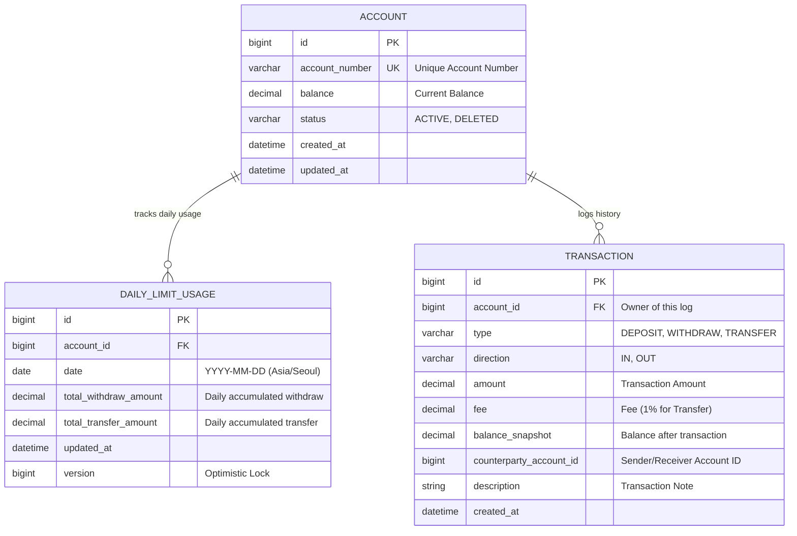

# Banking System ERD

## Overview
This ERD is designed based on the requirements for Account, Balance/Transaction, Limit Management, and Transfer features.

### Key Features
- **Account**: Supports soft delete (`status`).
- **Daily Limit**: Tracks daily withdrawal and transfer amounts separately using `DAILY_LIMIT_USAGE`.
- **Transaction**: Records all flow (Deposit, Withdraw, Transfer) with support for `OUT`/`IN` direction for transfers.

## Table Details

### 1. ACCOUNT
- Stores account information.
- `account_number`: Must be unique.
- `status`: Used for soft delete (F-1.2).
- `balance`: Current balance.

### 2. DAILY_LIMIT_USAGE
- Tracks daily usage for withdrawal and transfer limits (F-3.1, F-3.2).
- `date`: Based on Asia/Seoul 00:00~23:59.
- `version`: For optimistic locking to handle concurrency.

### 3. TRANSACTION
- Logs all financial activities (F-5.1).
- `direction`: `IN` (Deposit, Transfer Receive), `OUT` (Withdraw, Transfer Send).
- `fee`: Recorded separately (e.g., for Transfer OUT).
- `counterparty_account_id`: Stores the other party's account ID for transfers.
